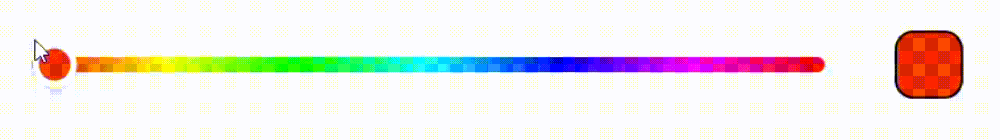
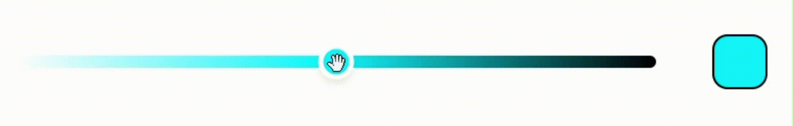

## 🎨 react-color-strip

A customizable horizontal color strip component for React.  
Supports both **Hue** and **Shade** modes with drag, keyboard, and accessibility support.

### 📺 Demo

| Hue Mode                                 | Shade Mode                                   |
| ---------------------------------------- | -------------------------------------------- |
|  |  |

You can also use both modes side by side by rendering two separate components and managing their states independently:


---

### 📦 Installation

```bash
npm install react-color-strip
# or
yarn add react-color-strip
```

---

### ✨ Features

- ⚡️ React + TypeScript
- 🎛 Dual mode: Hue selector or shade strip from a custom color
- 🧲 Pointer drag, keyboard, and focus accessibility
- 🧩 Fully customizable pointer and strip
- 🧠 Controlled component via `value`, `onChange`, `onChangeComplete`
- ♿ Accessible: `aria-*` slider support

---

### 🚀 Usage

```js
import React, { useState } from "react";
import ColorStrip from "react-color-strip";

function App() {
  const [color, setColor] = useState("#ff0000");

  return <ColorStrip value={color} onChange={({ hex }) => setColor(hex)} />;
}
```

---

### 🔧 Props

#### `ColorStripProps`

| Prop               | Type                            | Default     | Description                                                                                         |
| ------------------ | ------------------------------- | ----------- | --------------------------------------------------------------------------------------------------- |
| `value`            | `string`                        | `-`         | Current color value (hex, rgb, or hsl)                                                              |
| `width`            | `number`                        | `300`       | Width of the color strip in pixels                                                                  |
| `height`           | `number`                        | `20`        | Height of the color strip in pixels                                                                 |
| `disabled`         | `boolean`                       | `false`     | Disables user interaction                                                                           |
| `pointer`          | [`PointerProps`](#pointerprops) | -           | Customize the appearance and behavior of the pointer                                                |
| `style`            | `React.CSSProperties`           | `{}`        | Additional styling for the wrapper div                                                              |
| `rounded`          | `string \| number`              | `0`         | Border radius of the strip                                                                          |
| `customColor`      | `string`                        | `undefined` | If provided, switches to **Shade Mode** using this as base color                                    |
| `onChange`         | `(color: ColorValue) => void`   | -           | Called on color change during drag. See [ColorValue](#colorvalue).                                  |
| `onChangeComplete` | `(color: ColorValue) => void`   | -           | Called when user releases pointer or completes keyboard interaction. See [ColorValue](#colorvalue). |

#### `PointerProps`

Customize the pointer appearance:
| Prop | Type | Default |
| ----------------- | --------- | ------------------------------------- |
| `width` | `number` | `12` |
| `height` | `number` | `height of strip` |
| `backgroundColor` | `string` | `"white"` |
| `border` | `string` | `"none"` |
| `borderRadius` | `string` | `"2px"` |
| `boxShadow` | `string` | `"0 4px 6px -1px rgba(0, 0, 0, 0.1)"` |
| `scaleOnDrag` | `boolean` | `true` |
| `dragScale` | `number` | `1.1` |

#### `ColorValue`

The color object returned in onChange and onChangeComplete:

```typescript
interface ColorValue {
  hex: string;
  rgb: { r: number; g: number; b: number };
  hsl: { h: number; s: number; l: number };
}
```

---

## 👤 Author

Authored and maintained by [aviralj02](https://aviral.xyz).
